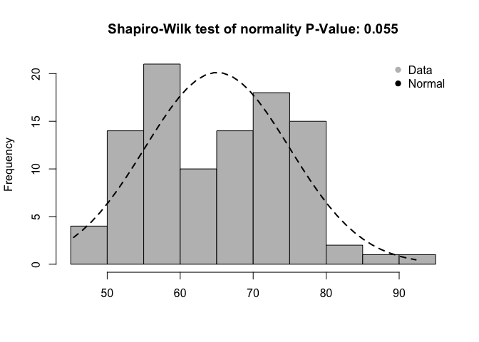

PhyloWizard Continuous
================

Let's make up test data
-----------------------

Here we go!!

``` r
test_data <- rnorm(n = 100, mean = 65, sd = 10)
```

Your data has a mean of 65.07, median of 65.34, and standard deviation of 9.91. The data range from 45.4 to 92.29.

The plot below shows the distribution of your data compared to a normal distribution with the same mean and standard deviation. The Shapiro-Wilk test of normality compares your data to a normal distribution. A significant p-value indicates that your data are significantly different from a normal distribution.


