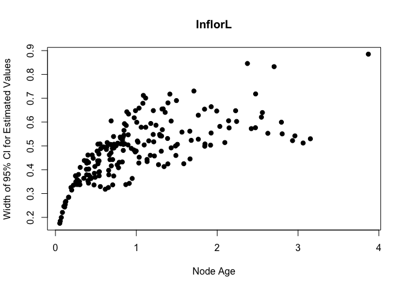

Continuous Ancestral State
================

Loading in sample data and running function
-------------------------------------------

``` r
tr  <- read.tree("/Users/carrietribble/Desktop/arbor_hackathon_docs/heliconia/Heliconia_all_dated_mod.phy")
trait <- read.csv('/Users/carrietribble/Desktop/arbor_hackathon_docs/heliconia/Heliconia_phylogeny_matrix.csv')

td <- treeplyr::make.treedata(tr, trait)

ace_arbor <- aRbor::aceArbor( select_(td, "InflorL"), charType='continuous', aceType = 'marginal')
```

Summary of Continuous Ancestral State Reconstruction
----------------------------------------------------

The mean value of InflorL extant values is 0.5427895, the reconstructed nodes have a mean value of 0.5434116. The original range of your data values is 0.07 to 3. The estimated node values range from 0.1064772 to 1.8471608. When we include the 95% confidence invervals for those estimates, the estimates range from -0.1053476 to 2.0914694. A portion of those estimates are displayed below.

|     |   lowerCI95|   estimate|  upperCI95|
|-----|-----------:|----------:|----------:|
| 191 |  -0.0173080|  0.4252032|  0.8677145|
| 192 |   0.0171425|  0.4334778|  0.8498131|
| 193 |  -0.0074521|  0.4154564|  0.8383650|
| 194 |  -0.0036365|  0.2988343|  0.6013051|
| 195 |   0.1962479|  0.5166668|  0.8370857|
| 196 |   0.3681162|  0.5873769|  0.8066376|
| 197 |   0.2558298|  0.5136536|  0.7714774|
| 198 |   0.2868183|  0.5410689|  0.7953194|
| 199 |   0.3355337|  0.5740100|  0.8124862|
| 200 |   0.2198461|  0.4510244|  0.6822026|
| 201 |   0.2291984|  0.4478164|  0.6664345|
| 202 |   0.3004194|  0.4679435|  0.6354675|
| 203 |   0.1551561|  0.4201140|  0.6850720|
| 204 |   0.1247209|  0.3957570|  0.6667931|
| 205 |   0.0336143|  0.3927010|  0.7517878|
| 206 |   0.0931921|  0.4171581|  0.7411240|
| 207 |   0.1557509|  0.4093899|  0.6630290|
| 208 |   0.0113636|  0.3617488|  0.7121341|
| 209 |   0.1469907|  0.3518700|  0.5567494|
| 210 |   0.1014583|  0.3767233|  0.6519884|

The plot below shows the relationship between the width of your 95% confidence intervals and time as indicated by node ages.



Some information might have been removed during analysis
--------------------------------------------------------

Be aware that the function dropped some tips of your phylogeny:

| x                                  |
|:-----------------------------------|
| Musella\_lasiocarpa                |
| Ensete\_ventricosum                |
| Ensete\_superbum                   |
| Musa\_coccinea                     |
| Musa\_sp12                         |
| Musa\_ornata                       |
| Musa\_basjoo                       |
| Monocostus\_uniflorus              |
| Globba\_winitii                    |
| Canna\_jaegeriana                  |
| Thaumatococcus\_daniellii          |
| Halopegia\_azurea                  |
| Orchidantha\_maxillarioides        |
| Ravenala\_madagascariensis         |
| Strelitzia\_reginae                |
| Strelitzia\_caudata                |
| H\_willisiana\_Collins\_EC9957     |
| H\_mooreana\_Ortega\_49\_AF        |
| H\_sp\_Specht\_0608                |
| H\_sp\_Kress\_943698               |
| H\_x\_rauliniana\_Abalo\_sn\_AF\_A |
| H\_berryi\_Wasshousen\_2106\_AF    |
| H\_gloriosa\_Collins\_96203        |
| H\_plowmania\_Kress\_943677        |
| H\_waoraniana\_Kress\_965694\_AF   |
| H\_x\_rauliniana\_Abalo\_sn\_AF\_B |
| H\_penduloides\_Kress\_sn          |
| H\_atratensis\_Kress\_903142       |
| H\_sp\_Specht\_0805                |

It might has dropped information from your trait data as well: No data was dropped.
