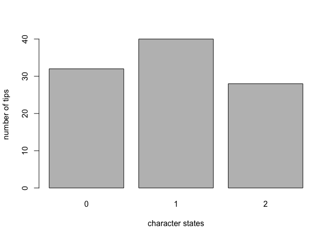

PhyloWizard Discrete
================

Let's make up test data
-----------------------

Here we go!!

``` r
test_multi <- sample(c(0,1,2), size = 100, replace = TRUE)
test_binary <- sample(c(0,1), size = 100, replace = TRUE)
```

Your data is multi state. You have 100 observations and 3 character states.

| Char. States |  Num. of Tips|
|:-------------|-------------:|
| 0            |            32|
| 1            |            40|
| 2            |            28|


